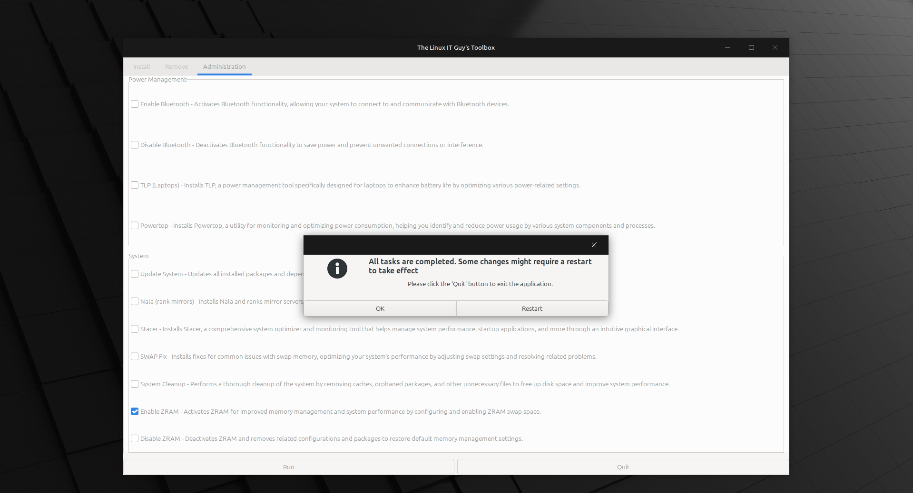

# The Linux IT Guy Toolbox

Add and Remove software on Linux with the click of a button

# Supported Distros

## How do I use it?
There are two options: Release and Git. Please choose one.

### Git method
1. From a Terminal, clone this project and cd into it: 
    1. `git clone https://github.com/TheLinuxITGuy/The-Linux-IT-Guy-Toolbox.git && cd The-Linux-IT-Guy-Toolbox && python3 Main.py`
2. Select the Application you would like to Install/Remove
    1. If an application is missing that you'd like to install, you can edit the `apps_config.csv` to add more
    2. Format: `Category,AppName(case sensitive),Flatpak location`
3. Click Run

### Release method
1. Download the latest .tar.gz release into your ~/Downloads folder
2. Open a Terminal
    1. Type: `cd ~/Downloads`
    2. Type: `tar -xzf The-Linux-IT-Guy-Toolbox-1.x.tar.gz && cd The-Linux-IT-Guy-Toolbox-1.x && python3 Main.py` Replace the x with the version you downloaded
3. Select the Application you would like to Install/Remove
    1. If an application is missing that you'd like to install, you can edit the `apps_config.csv` to add more
    2. Format: `Category,AppName(case sensitive),Flatpak location`
4. Click Run

## Video

## What does each script do?
- **apps_config.csv** The config file that specifies the applications to be listed in the GUI for install
- **Main.py:** GUI that allows you to Install/Remove applications all at once
- **main.sh:** The script that Installs/Removes the applications selected

## Donate
https://www.paypal.com/donate/?hosted_button_id=WPTX2BMBARSG2
