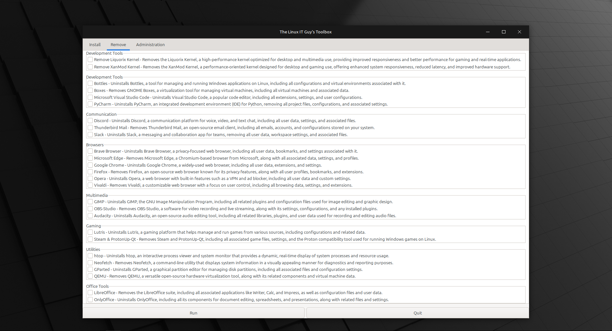

# Linux Mint Scripts

Add and Remove the pre-installed software from Linux Mint with the click of a button.



## How do I use it?

There are two options: Release and Git. Please choose one.

### Prerequisites

Make sure you have the following installed:

- Python 3
- GTK 3 (`sudo apt-get install python3-gi python3-gi-cairo gir1.2-gtk-3.0`)

### Git method

1. From a Terminal, clone this project and cd into it:
   1. `git clone https://github.com/TheLinuxITGuy/Linux-Mint-Scripts.git && cd Linux-Mint-Scripts`
   2. Make the scripts executable: `chmod u+x ./*.*`
   3. Run the main script: `./Main.py`
2. Select the Application you would like to Install/Remove.
3. Click Run.

### Release method

1. Download the latest .tar.gz release into your ~/Downloads folder.
2. Open a Terminal.
   1. Navigate to the Downloads folder: `cd ~/Downloads`
   2. Extract the tarball and navigate into the directory: `tar -xzf Linux-Mint-Scripts-1.x.tar.gz && cd Linux-Mint-Scripts-1.x` (Replace the x with the version you downloaded)
   3. Make the scripts executable: `chmod u+x ./*.*`
   4. Run the main script: `./Main.py`
3. Select the Applications you would like to Install/Remove.
4. Click Run.

## Video

[](https://youtu.be/PJytFBO3seM)
[]

## What does each script do?

- **Main.py:** GUI that allows you to Install/Remove applications all at once.
- **AfterInstall.sh:** Runs ALL the scripts. **Use Main.py instead**.
- **install-bravebrowser.sh:** Adds the Brave repo's GPG key, Adds the Brave repo, Updates the package list, Downloads and Installs Brave.
- **install-chromebrowser.sh:** Updates the package list, Downloads the .deb package to your ~/Downloads folder, Installs Chrome along with any missing dependencies.
- **install-code:** Updates the package list, Adds Flathub repo if needed, Downloads and Installs Visual Studio Code.
- **install-discord:** Updates the package list, Adds Flathub repo if needed, Downloads and Installs Discord.
- **install-edge:** Updates the package list, Adds Flathub repo if needed, Downloads and Installs Microsoft Edge.
- **install-gimp:** Updates the package list, Adds Flathub repo if needed, Downloads and Installs GIMP.
- **install-lutris.sh:** Updates the package list, Adds Flathub repo if needed, Downloads and Installs Lutris.
- **install-steam&protonupqt.sh:** Updates the package list, Downloads and Installs Steam along with any missing dependencies, Downloads and Installs ProtonUp-Qt.
- **remove-firefox.sh:** Removes Firefox.
- **remove-libreoffice.sh:** Removes Libre Office.
- **remove-thunderbird.sh:** Removes Thunderbird Mail.
- **install-vlc.sh:** Updates the package list, Downloads and Installs VLC media player.
- **install-spotify.sh:** Adds the Spotify repo, Updates the package list, Downloads and Installs Spotify.
- **install-zoom.sh:** Downloads the Zoom .deb package, Installs Zoom along with any missing dependencies.

## Configuring Sudo Permissions

To allow the script to reboot the system without prompting for a password, you can configure sudoers:

1. Open the sudoers file with visudo:

   ```sh
   sudo visudo
   ```

2. Add the following line at the end of the file, replacing `your_username` with your actual username:
   ```sh
   your_username ALL=(ALL) NOPASSWD: /sbin/reboot
   ```

## Contributing

If you would like to contribute to this project, please follow these steps:

1. Fork the repository.
2. Create a new branch (`git checkout -b feature-branch`).
3. Make your changes.
4. Commit your changes (`git commit -am 'Add new feature'`).
5. Push to the branch (`git push origin feature-branch`).
6. Create a new Pull Request.

## License

This project is licensed under the MIT License - see the [LICENSE](LICENSE) file for details.
