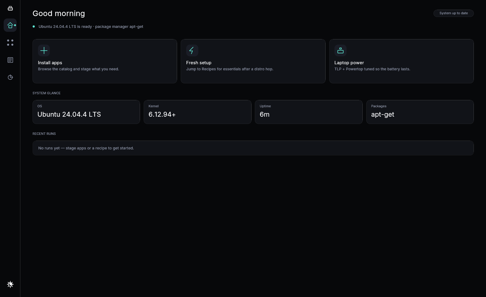
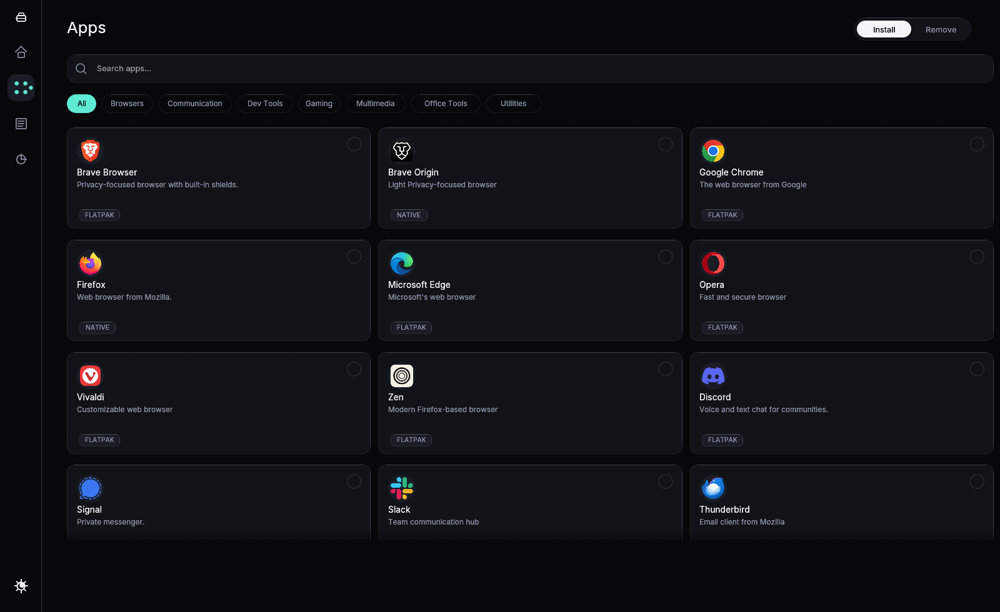
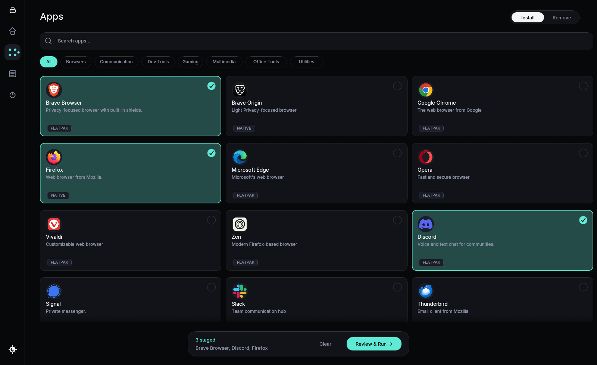
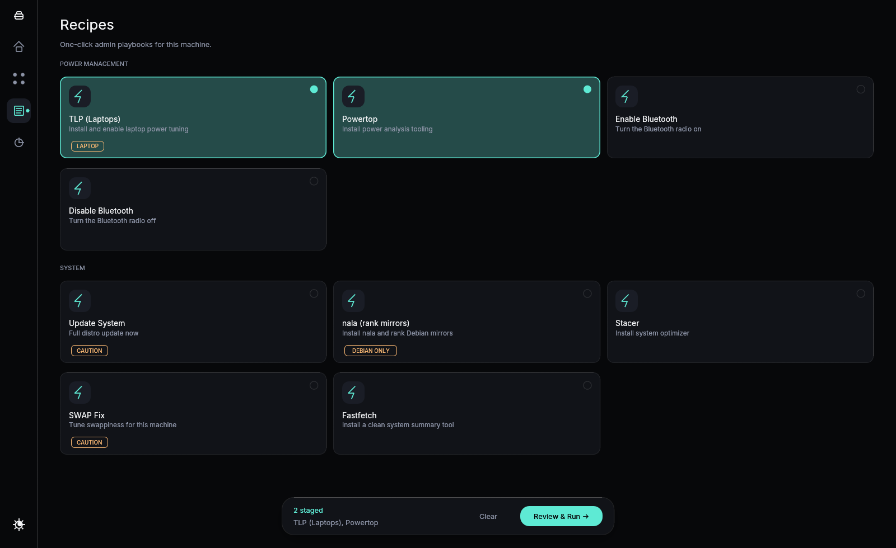
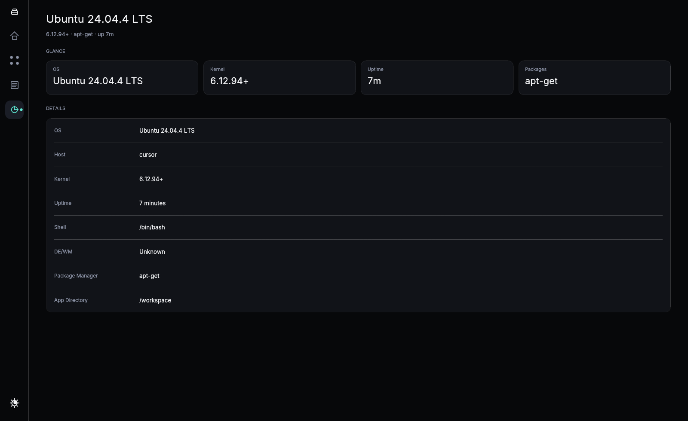

# 🧰 The Linux IT Guy Toolbox


A fast Rust desktop app for installing/removing apps and running Linux admin tasks with one click.



> [!NOTE]
> #### Supported Distros
> 
> 
> 

## ✨ What It Does

- **Home** dashboard with install/setup intents, a live system glance, and recent runs
- **Apps** to install or remove native packages and Flatpaks, with a Run Dock when items are staged
- **Recipes** for one-click admin playbooks (updates, Bluetooth, TLP, Powertop, and more)
- **System** page with live machine details
- **Lumen Dark** by default, with a light theme toggle on the rail
- Works across multiple distros

## 🚀 Quick Start

```bash
git clone https://github.com/TheLinuxITGuy/Toolbox.git
cd Toolbox
cargo build --release
./target/release/linux-it-guy-toolbox
```

Prebuilt binaries are published on the [GitHub Releases](https://github.com/TheLinuxITGuy/Toolbox/releases) page.

If your distribution's `rustc`/`cargo` is older than 1.92:

```bash
curl --proto '=https' --tlsv1.2 -sSf https://sh.rustup.rs | sh
. "$HOME/.cargo/env"
```

## 📖 Usage

1. Use the rail: **Home**, **Apps**, **Recipes**, or **System**
2. On **Apps**, switch **Install** or **Remove**, then stage what you need
3. On **Recipes**, stage the playbooks you want to run
4. When the **Run Dock** appears, click **Review & Run**, enter your sudo password, and follow progress in the **Run Drawer** (then Dismiss when you are done)









## 🔧 Requirements

**If `cargo build --release` fails, your distribution might be missing git or GUI build packages (xcb, xkbcommon, OpenSSL, and similar).**

### Arch
```bash
sudo pacman -Syu git rust cargo
```

### Linux Mint / Debian
```bash
sudo apt install -y git cargo rustc libxcb-render0-dev libxcb-shape0-dev libxcb-xfixes0-dev libxkbcommon-dev libssl-dev
```

### Fedora
```bash
sudo dnf install -y git cargo rust libxcb-devel libxkbcommon-devel openssl-devel
```

### Silverblue / bazzite / ublue
```bash
rpm-ostree install -y git cargo rust libxcb-devel libxkbcommon-devel openssl-devel
```

## 📋 App Catalog

Apps are defined in `apps_config.csv` with columns:
- `Category`, `Label`, `Package Name`, `Flatpak ID`, `Exec Name`, `Notes`

Users can add applications by editing the `apps_config.csv` file.

>[!NOTE]
> - Some apps are better as Flatpaks on certain distros
> - Some admin actions are distro-specific
> - Optional packages may not be in all default repositories

## 🎬 Video

[](https://youtu.be/PJytFBO3seM)

## 💝 Sponsor

https://github.com/sponsors/TheLinuxITGuy
