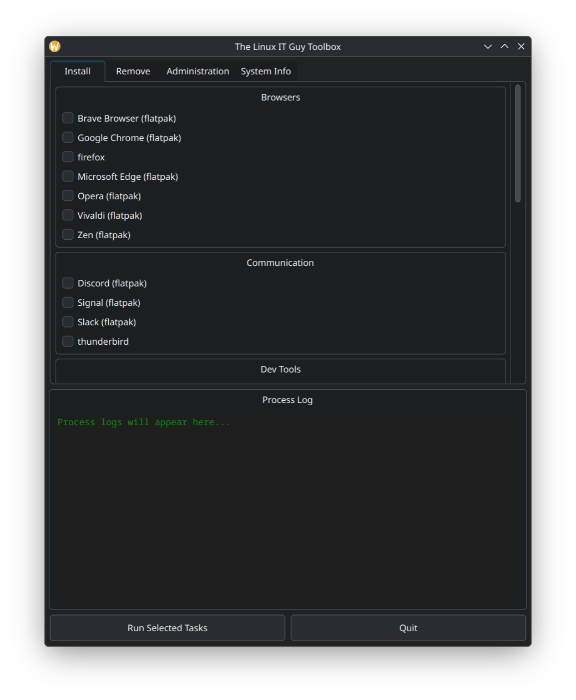

# The Linux IT Guy Toolbox




**The Linux IT Guy Toolbox** is a Python GUI for installing apps, removing apps, and running a few practical Linux admin tasks without memorizing package names or Flatpak IDs.

## What it does

- Install native packages and Flatpak apps from one UI
- Remove native packages and Flatpak apps from one UI
- Run common admin helpers like system updates, Bluetooth toggles, and TLP setup
- Show lightweight local system information
- Work across Debian-based, Arch-based, and Fedora-based distributions

## Requirements

### Arch
```bash
sudo pacman -Syu git pyside6
```

### Debian / Ubuntu / Linux Mint
```bash
sudo apt update && sudo apt install -y git python3-pyside6
```

### Fedora
```bash
sudo dnf install -y git python3-pyside6
```

> If PySide6 is missing, the app will try to bootstrap it automatically.

## Install

```bash
git clone https://github.com/TheLinuxITGuy/Toolbox.git
cd Toolbox
python3 Main.py
```

## Usage

1. Open the **Install** tab and choose native packages or Flatpaks.
2. Open the **Remove** tab to uninstall apps.
3. Open **Administration** for system tasks.
4. Click **Run Selected Tasks** and enter your sudo password when prompted.
5. Review progress in the built-in process log.

## App catalog

The application catalog lives in `apps_config.csv`.

Current columns:
- `Category`
- `Label`
- `Package Name`
- `Flatpak ID`
- `Exec Name`
- `Notes`

That structure makes it easier to keep user-facing labels separate from package names and Flatpak IDs.

## Notes

- Flatpak installs use the Flathub remote.
- Native package install detection now uses package-manager queries instead of guessing from executable names.
- The GUI resolves files relative to `Main.py`, so it does not depend on your current working directory.

## Video
[](https://youtu.be/PJytFBO3seM)

## Supported distros


## Sponsor
https://www.paypal.com/donate/?hosted_button_id=WPTX2BMBARSG2
