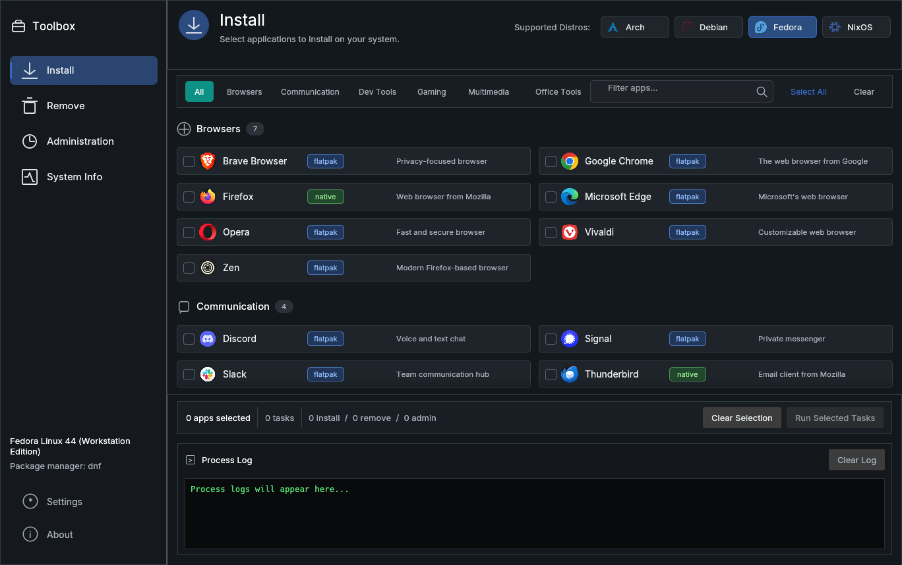

# 🧰 The Linux IT Guy Toolbox


A fast Rust desktop app for installing/removing apps and running Linux admin tasks with one click.



**Supports:** Arch, Debian, Fedora, NixOS 

🛑 **Linux Mint 22.3** DON'T UPGRADE YET. Ubuntu 26.04 LTS works - wait for Linux Mint 23 based on 26.04 to be released

## ✨ What It Does

- Install and remove native packages and Flatpak apps from one UI
- Run system admin tasks (updates, Bluetooth toggle, TLP setup, etc.)
- Show local system information
- Works across multiple distros

## 🚀 Quick Start

```bash
git clone https://github.com/TheLinuxITGuy/Toolbox.git
cd Toolbox
chmod +x linux-it-guy-toolbox
./linux-it-guy-toolbox
```

## 📖 Usage

1. **Install tab** → Select native packages or Flatpaks
2. **Remove tab** → Uninstall apps
3. **Administration tab** → Run system tasks
4. Click **Run Selected Tasks** → Enter sudo password
5. Check the process log for progress

## 🔧 Requirements

**Build:**
```bash
# Arch
sudo pacman -Syu git rust cargo

# Debian/Ubuntu 26.04 LTS
sudo apt install -y git cargo rustc libxcb-render0-dev libxcb-shape0-dev libxcb-xfixes0-dev libxkbcommon-dev libssl-dev

# Fedora
sudo dnf install -y git cargo rust libxcb-devel libxkbcommon-devel openssl-devel

# NixOS
nix-shell -p cargo rustc pkg-config xorg.libxcb libxkbcommon openssl

# NixOS without installing
nix run github:TheLinuxITGuy/Toolbox --extra-experimental-features 'nix-command flakes'
```

## 📋 App Catalog

Apps are defined in `apps_config.csv` with columns:
- `Category`, `Label`, `Package Name`, `Flatpak ID`, `Exec Name`, `Nix Package`, `Notes`

Users can add applications be editing the `apps_config.csv` file.

## ❄️ NixOS Support

On NixOS, installs and removals are handled declaratively instead of using `nix-env`.

- The app detects NixOS with `/etc/NIXOS`.
- Selected apps use the `Nix Package` value from `apps_config.csv`.
- The first NixOS change creates `/etc/nixos/toolbox-packages.nix`.
- The app imports that file from `/etc/nixos/configuration.nix`, backing up the original as `/etc/nixos/configuration.nix.toolbox.bak`.
- Changes are applied with `sudo nixos-rebuild switch`.

Some packages, especially unfree apps such as Chrome, Steam, and VS Code, may also require the user's NixOS configuration to allow unfree packages or enable app-specific NixOS options.

## ⚠️ Known Limitations

- NixOS support manages a dedicated `/etc/nixos/toolbox-packages.nix` module
- Some apps are better as Flatpaks on certain distros
- Some admin actions are distro-specific
- Optional packages may not be in all default repositories

## 🎬 Video

[](https://youtu.be/PJytFBO3seM)

## 🖥️ Supported Distros


## 💝 Sponsor

https://www.paypal.com/donate/?hosted_button_id=WPTX2BMBARSG2
