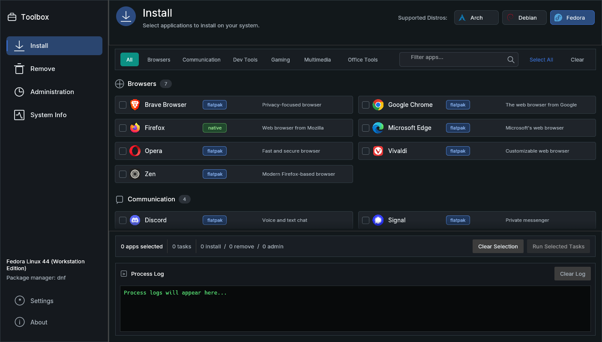

# 🧰 The Linux IT Guy Toolbox


A fast Rust desktop app for installing/removing apps and running Linux admin tasks with one click.



> [!NOTE]
> #### Supported Distros
> 
> 
> 

## ✨ What It Does

- Install and remove native packages and Flatpak apps from one UI
- Run system admin tasks (updates, Bluetooth toggle, TLP setup, etc.)
- Show local system information
- Works across multiple distros

## 🚀 Quick Start

Build from source (Rust 1.92 or newer):

```bash
git clone https://github.com/TheLinuxITGuy/Toolbox.git
cd Toolbox
cargo build --release
./target/release/linux-it-guy-toolbox
```

Prebuilt binaries are published on the [GitHub Releases](https://github.com/TheLinuxITGuy/Toolbox/releases) page.

If your distribution's `rustc` package is older than 1.92, install a current toolchain with [rustup](https://rustup.rs/).

## 📖 Usage

1. **Install tab** → Select native packages or Flatpaks
2. **Remove tab** → Uninstall apps
3. **Administration tab** → Run system tasks
4. Click **Run Selected Tasks** → Enter sudo password
5. Check the process log for progress

## 🔧 Requirements

**If the Quick Start script runs into any issues, your distribution might be missing a few foundational packages.**

### Arch
```bash
sudo pacman -Syu git rust cargo
```

### Linux Mint / Debian
```bash
sudo apt install -y git cargo rustc libxcb-render0-dev libxcb-shape0-dev libxcb-xfixes0-dev libxkbcommon-dev libssl-dev
```

### Fedora
```bash
sudo dnf install -y git cargo rust libxcb-devel libxkbcommon-devel openssl-devel
```

### Silverblue / bazzite / ublue
```bash
rpm-ostree install -y git cargo rust libxcb-devel libxkbcommon-devel openssl-devel
```

## 📋 App Catalog

Apps are defined in `apps_config.csv` with columns:
- `Category`, `Label`, `Package Name`, `Flatpak ID`, `Exec Name`, `Notes`

Users can add applications by editing the `apps_config.csv` file.

>[!NOTE]
> - Some apps are better as Flatpaks on certain distros
> - Some admin actions are distro-specific
> - Optional packages may not be in all default repositories

## 🎬 Video

[](https://youtu.be/PJytFBO3seM)

## 💝 Sponsor

https://github.com/sponsors/TheLinuxITGuy
